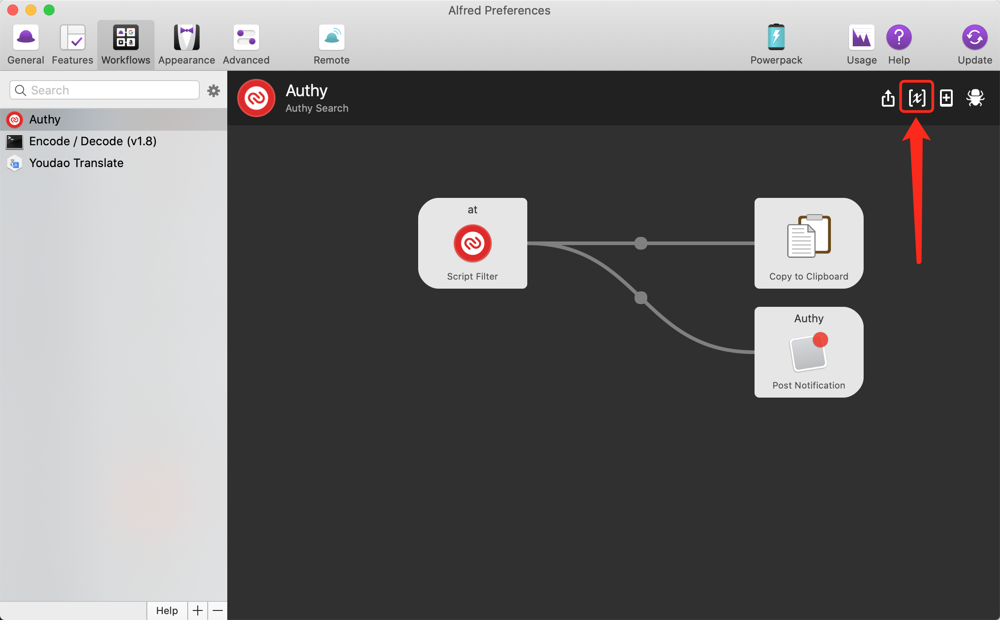
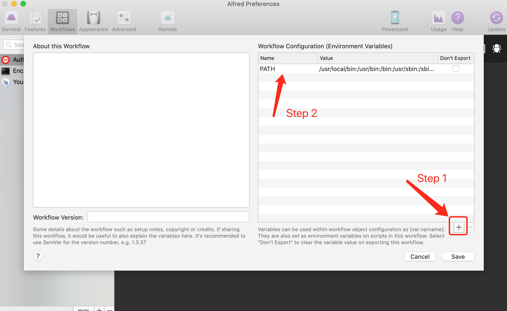
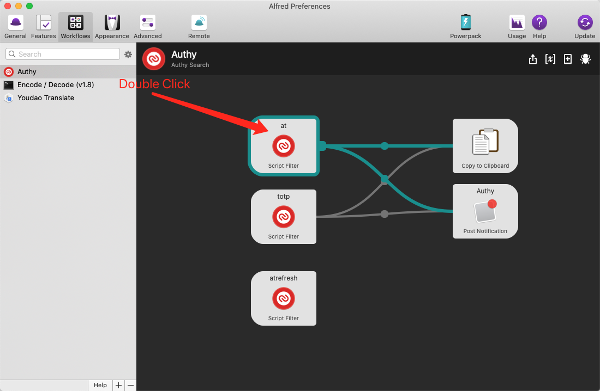
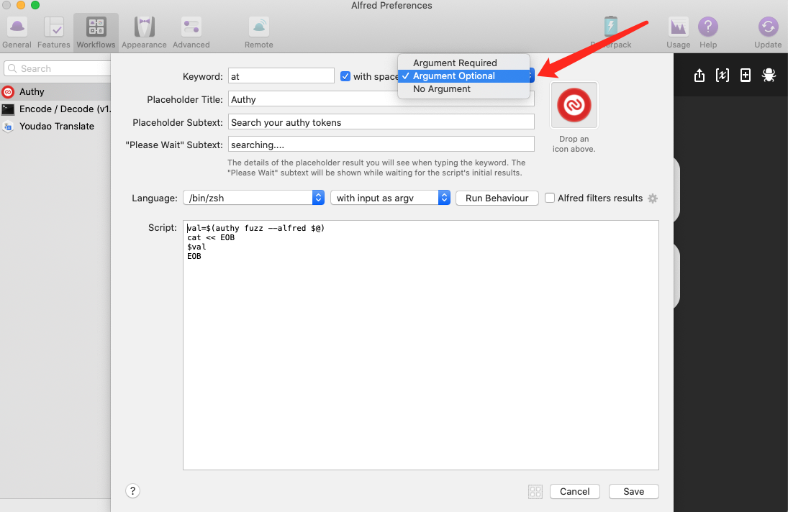

## **Important Notice**
Twilio has detected that threat actors were able to identify data associated with Authy accounts, including phone numbers, due to an unauthenticated endpoint. Twilio has taken action to secure this endpoint and no longer allow unauthenticated requests. More details are available [here](https://www.twilio.com/en-us/changelog/Security_Alert_Authy_App_Android_iOS)

**This workflow doesn't work now!!**

## Authy

Authy Commandline Tool mainly for Alfred Workflow

### Installation

Pre-built binaries are available from the [releases page](https://github.com/momaek/authy/releases).

Alternatively, it can be compiled from source, which requires [Go 1.20.3 or newer](https://golang.org/doc/install):

```
go get github.com/momaek/authy
```

### To use it
0. Rename `authy-darwin-amd64` or `authy-darwin-arm64` to `authy`
1. Move `authy` to your local `$PATH`
2. Run `authy account`. The command will prompt you for your phone number country code (e.g. 1 for United States) and your phone number. This is the number that you used to register your Authy account originally.
3. If the program identifies an existing Authy account, it will send a device registration request using the push method. This will send a push notification to your existing Authy apps (be it on Android, iOS, Desktop or Chrome), and you will need to respond that from your other app(s).
4. If the device registration is successful, the program will save its authentication credential (a random value) to `$HOME/.authy.json` for further uses.
5. Run `authy refresh`. The command will prompt you for your Authy backup password. This is required to decrypt the TOTP secrets for the next step. 
6. Run `authy fuzz {query}` will get an AlfredWorkflow style output
7. Download AlfredWorkflow [Authy.alfredworkflow](https://github.com/momaek/authy/raw/master/alfredworkflow/Authy.alfredworkflow)
8. Double click `Authy.alfredworkflow` or manual import from Alfred
9. Open Alfred and type `at {query}`

### *Optional Configuration*
By default, the authy config file (.authy.json) and cache (.authy.cache) are stored in `$HOME`.
A custom configuration directory can be set with the environment variable `$AUTHY_ROOT`

e.g.
```
export AUTHY_ROOT=~/.dotfiles/secrets/authy
```
the example above would create the config file `~/.dotfiles/secrets/authy/.authy.json`


#### Attention
To use this tool, you should enable *Allow Multi-Device* in your Authy App

e.g.


### Update

#### 2021-03-11
Default show all results.

### FAQ

##### Telegram Group
[TG](https://t.me/joinchat/wPHG5rxjGLs0NjQ9)

##### Q: Don't work/Don't show result
A: You may update Workflow Configuration(Environment Variables). Add Name/Value:

|Name|Value|
|----|----|
|PATH| /usr/local/bin:/usr/bin:/bin:/usr/sbin:/sbin:{your_binaryfile_path}|




##### Q: Default don't show all results
A: Switch to `Argument Optional`




