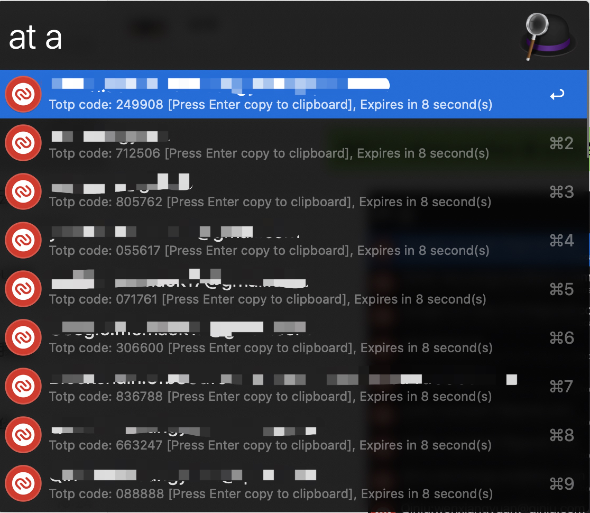

## Authy

Authy Commandline Tool mainly for Alfred Workflow

#### Installation

Pre-built binaries are available from the releases page.

Alternatively, it can be compiled from source, which requires [Go 1.12 or newer](https://golang.org/doc/install):

```
go get github.com/momaek/authy
```

#### To use it
1. Move downloaded binary to your local `$PATH`
2. Run `authy account`. The command will prompt you for your phone number country code (e.g. 1 for United States) and your phone number. This is the number that you used to register your Authy account originally.
3. If the program identifies an existing Authy account, it will send a device registration request using the push method. This will send a push notification to your existing Authy apps (be it on Android, iOS, Desktop or Chrome), and you will need to respond that from your other app(s).
4. If the device registration is successful, the program will save its authentication credential (a random value) to $HOME/.authy.json for further uses.
5. Run `authy refresh`. The command will prompt you for your Authy backup password. This is required to decrypt the TOTP secrets for the next step. 
6. Run `authy fuzz {query}` will get an AlfredWorkflow style output
7. Download AlfredWorkflow [Authy.alfredworkflow](https://github.com/momaek/authy/raw/master/alfredworkflow/Authy.alfredworkflow)
8. Double click `Authy.alfredworkflow` or manual import from Alfred
9. Open Alfred and type `at {query}`

e.g.

